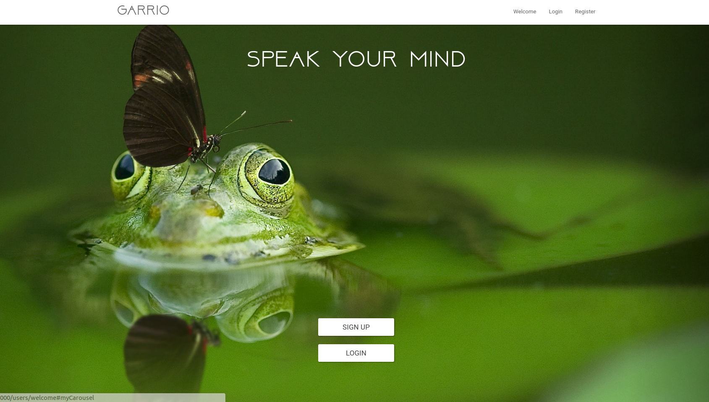
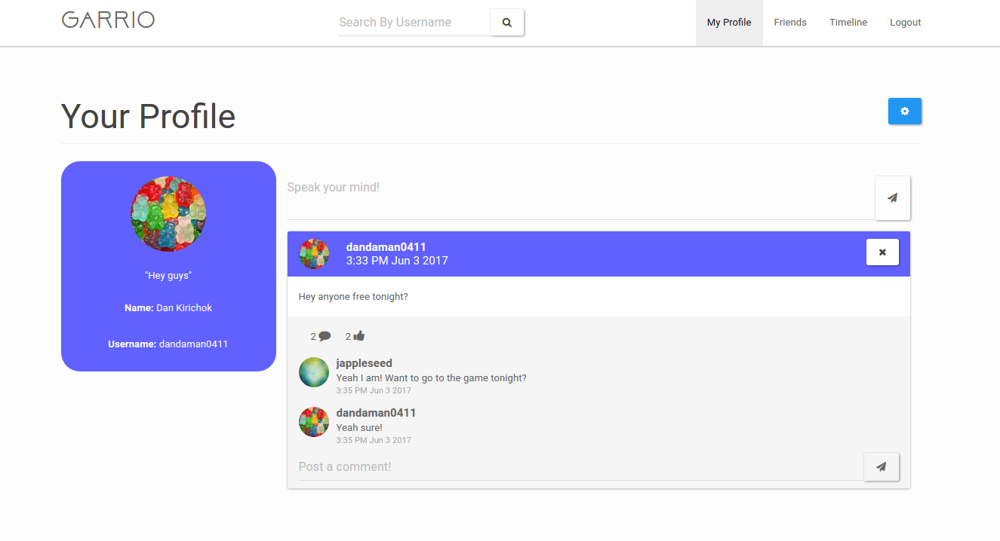
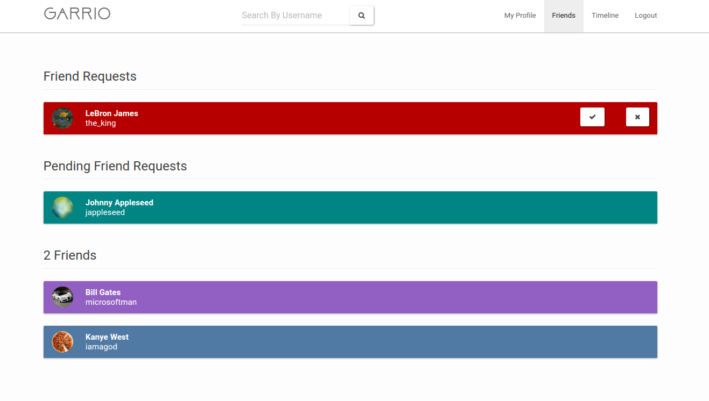
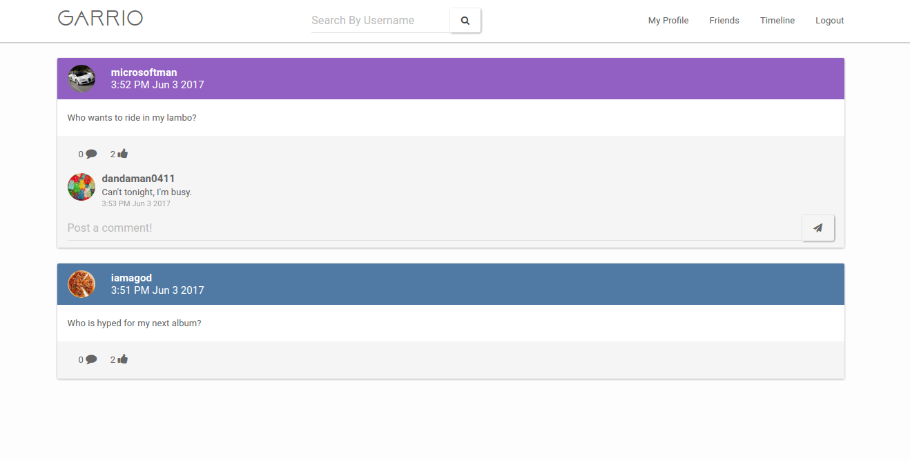

# Garrio: A Social Network

I was playing around with Node.JS and I decided to make a social network based off of twitter.
I used handlebarsjs to do templating, mongodb as a database, and Node.JS as the backend.


This project comes with login and registration capabilities stored through mongoose online db.



Users can customize their profile and post whatever is on their mind.



Users can become friends with each other.



Users can see what is going on with their friends through the timeline feature.

<br>

To run the project, go to the main directory and run the command below.
```
node app.js
```
Then go to [localhost:4000](http://localhost:4000) to view the project.

<br>

The default port it is run at is 4000, but you can change it in the server.js file.

